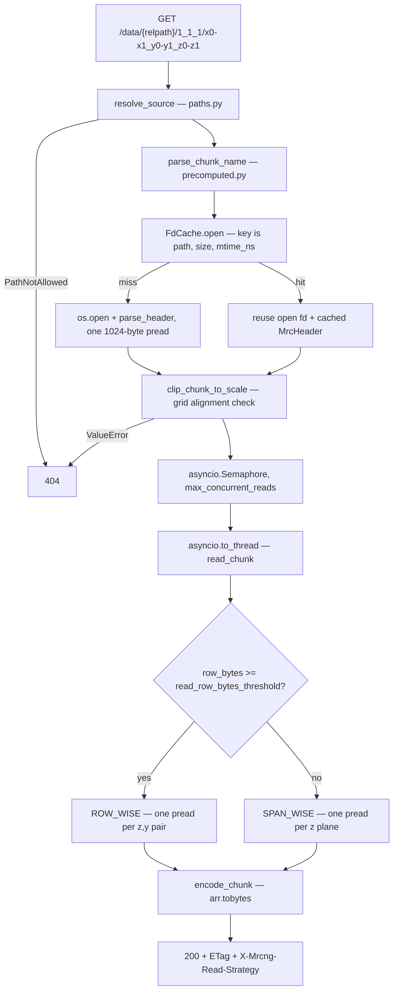

# Why MRC, and how a chunk is actually read

Background for anyone touching `reader.py`, `mrcheader.py`, or thinking about
adding another source format. Everything here is about **scale 0**, which is
the only level served straight from the source file — scales 1..N are
pre-written raw blocks in the cache and are format-agnostic.

## MRC is not chunked. That is the feature.

```
┌───────────────┬─────────────────┬──────────────────────────────────────────┐
│ 1024-byte     │ extended header │ raw voxels, C-order, x fastest, z slowest │
│ header        │ (nsymbt bytes)  │                                           │
└───────────────┴─────────────────┴──────────────────────────────────────────┘
0               1024              data_offset
```

One flat contiguous array. No directory, no offset table, no chunk index, no
compression, and a fixed `itemsize` implied by `mode`. Once you have read the
first 1024 bytes you know the address of every voxel in the file by arithmetic
(`mrcheader.py:4`):

```
offset(x, y, z) = data_offset + (z*ny*nx + y*nx + x) * itemsize
data_offset     = 1024 + nsymbt                        # mrcheader.py:154
```

That single property is what the server is built on.

| Property | Consequence for this server |
|---|---|
| No indirection — address is a multiply-add | No IFD walk, no chunk-index lookup. `FdCache` parses the header once per `(path, size, mtime_ns)` (`fdcache.py:77`) and never touches it again; every later request is pure `pread`. |
| No codec | A byte offset *is* the byte offset. Nothing forces inflating a whole compression block to extract 64 voxels. |
| Fixed-size, self-delimiting header prefix | `compute_header_sha256(fd, data_offset)` (`fingerprint.py:37`) is a cheap, meaningful identity digest — the basis of staleness detection. |
| Size is computable from the header | `required = data_offset + nx*ny*nz*itemsize` vs. `file_size` catches truncation before a byte is served (`mrcheader.py:155`). |

Supported modes (`mrcheader.py:17-34`):

| mode | on-disk dtype | served as | note |
|---|---|---|---|
| 0 | `int8` / `uint8` | same | signedness ambiguous without an IMOD stamp; see `MRCNG_ASSUME_MODE0` |
| 1 | `int16` | same | the common tomogram case |
| 2 | `float32` | same | |
| 6 | `uint16` | same | |
| 12 | `float16` | `float32` | Neuroglancer has no float16 at all; widening is exact |
| 3, 4 | complex | — | rejected (`UnsupportedModeError`) |

## How a chunk request becomes `pread` calls



Nothing on this path allocates more than the chunk itself, and nothing writes.

## The box is not contiguous

A precomputed chunk is a box `[x0:x1, y0:y1, z0:z1]`. On disk only the **x-runs**
are contiguous. A 64³ chunk is 64 × 64 = **4096 separate 64-voxel runs**,
scattered across the file:

```
z = 500 ────────────────────────────────────────────────────────
  y=2048   ......[####............................................]......
  y=2049   ......[####............................................]......
  y=2050   ......[####............................................]......
             ↑ 64 voxels wanted        ↑ nx = 4096 voxels per row
             the runs are nx*itemsize bytes apart
z = 501 ─── (ny*nx*itemsize bytes further along the file) ───────
```

So the cost of a read is roughly **the number of contiguous runs**, i.e.
`(z1-z0) * (y1-y0)`, not the number of voxels. `reader.py` has two ways to pay
it, selected by `choose_strategy` on `row_bytes = (x1-x0) * itemsize` against
`MRCNG_READ_ROW_BYTES_THRESHOLD` (default 4096 = one page):

**`ROW_WISE`** (`reader.py:61-67`) — one `pread` per `(z, y)` pair. Reads exactly
the bytes wanted, zero over-read, one syscall per run.

**`SPAN_WISE`** (`reader.py:68-82`) — one `pread` per `z`, spanning `(z, y0, x0)`
through `(z, y1-1, x1)` *including the gaps between the y rows*, then slicing
the x columns out in numpy:

```python
span_len = (y1 - 1 - y0) * hdr.nx + row_len
```

Trades an `nx/(x1-x0)` over-read for `(y1-y0)`× fewer syscalls.

### Worked example

`nx=4096, ny=4096, nz=1000`, mode 1 (`int16`), `nsymbt=0`, chunk
`1024-1088_2048-2112_500-564` — a 64³ box returning 512 KB.

`row_bytes = 64 * 2 = 128` bytes, which is under the 4096-byte threshold →
**span-wise**.

| | syscalls | bytes off disk | useful bytes |
|---|---|---|---|
| `ROW_WISE` | 4096 × 128 B | **~16 MB** — each 128-byte read still faults a 4 KB page | 512 KB |
| `SPAN_WISE` | 64 × 504 KB | **~31.5 MB** | 512 KB |

Row-wise's "exact" read is a fiction at this width: the kernel faults a full
page per row regardless, so it reads ~16 MB anyway — with 64× the syscalls.
Span-wise pays ~2× the bytes for 1/64 the syscalls.

Which side wins is a property of the storage, not of the code: on NFS a syscall
is a network round-trip and span-wise routs; on local NVMe it can invert. Hence
a tunable and not a constant (`config.py:20-24`), and hence every response
carries `X-Mrcng-Read-Strategy` (`app.py:249`) so a benchmark sweep can
attribute latency per strategy.

The over-read is not pure waste either: it covers exactly the bytes the
neighbouring x-chunks need, and Neuroglancer requests adjacent chunks in one
batch, so they hit the page cache (`reader.py:71-74`).

## Two details that are easy to break

- **Everything goes through `pread_exact`** (`reader.py:24-35`), which loops
  because a short read is legal — never bare `os.pread` anywhere else.
- **Offsets use `hdr.dtype`, the output buffer uses `hdr.served_dtype`**
  (`reader.py:59`). For mode 12 each float16 row upcasts to float32 as it lands,
  so nothing downstream ever sees a dtype Neuroglancer cannot render, while
  every byte offset stays on the on-disk itemsize.

## Why `pread` and not `mmap`

`pread` takes an explicit offset and touches no shared file state, so one fd out
of `FdCache` is safe to hand to `asyncio.to_thread` under the concurrency
semaphore (`app.py:220`). `mmap` would give `SIGBUS` on truncation instead of a
catchable `UnexpectedEOF`, and page-fault storms that no semaphore can bound.

## The same trade-off, exploited backwards

`pyramid.py:95-108` builds level 1 by reading **full-width rows** specifically to
force `read_chunk` down the row-wise path, so every source byte is touched once.
Reading one output chunk at a time would make each source read `chunk_x * fx`
columns wide — under a page for the usual 64/int16 case — so it would go
span-wise and re-read the whole row prefix once per x-chunk: 16.5× the volume in
bytes and 32× the syscalls on a 4096-wide tomogram. Same knob, opposite
direction.

## Where MRC is still anisotropic

Cost ≈ contiguous runs ≈ `(z1-z0) * (y1-y0)`.

| read shape | contiguous runs | verdict |
|---|---|---|
| whole XY plane | 1 | free |
| 64³ cube | 4096, across 64 separated file regions | tolerable |
| whole XZ plane | `nz * 1` runs, `nz` regions | expensive |

So MRC carries the same directional bias as a plane-oriented format — just
~64× rather than ~4000×, and with no decompression on top. Tolerable, not free.

## What this means for other formats

| format | address a voxel by | random-access a 64³ box |
|---|---|---|
| MRC / `.rec` / raw | arithmetic on the header | one `pread` per run, no decode |
| **tiled** TIFF | tile offset table per IFD | fine — comparable to MRC |
| **striped** TIFF | strip offset table per IFD, usually LZW/deflate | decompress ~64 full planes per chunk; on a 4096² int16 stack that is ~2 GB to return 512 KB |
| Zarr / HDF5 | chunk index | fine if the stored chunking matches; otherwise same amplification |
| OME-TIFF | as TIFF, plus SubIFD pyramid | may already contain its own pyramid, making `mrc-pyramid` partly redundant |

MRC's lacks are real — no internal pyramid, no tiling, no compression — which is
why `mrc-pyramid` exists at all. But "no chunking" is precisely what makes
arbitrary-box `pread` viable, and that is what lets the server serve an
uncached file with nothing on the request path but arithmetic and one syscall
per run.
